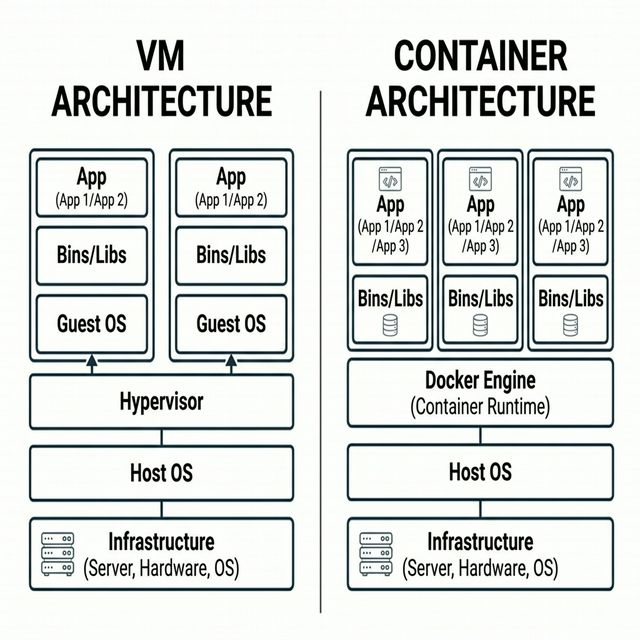
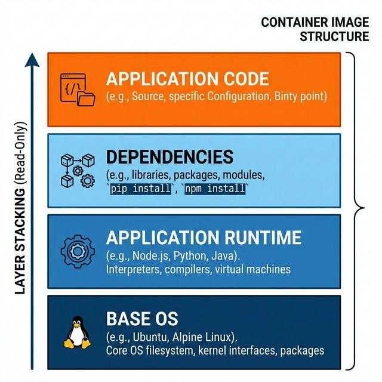
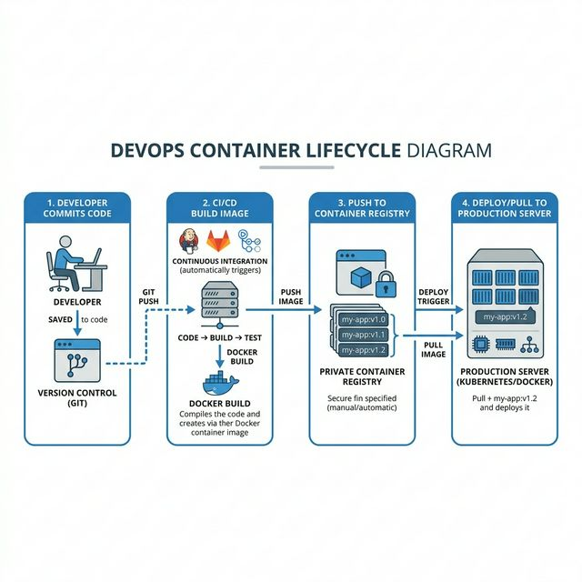

# 🐳 Week 1: Introduction to Containerization

Welcome to your guide on containerization. This document covers the core concepts, internal mechanisms, and real-world workflows for modern infrastructure.

---

## 📑 Table of Contents
1. [Overview & Characteristics](#1-what-is-containerization)
2. [Evolution: Monolith vs. VM vs. Container](#2-the-evolution-from-monolithic-to-microservices)
3. [The Core: Container Runtime](#3-container-runtime)
4. [Internal Mechanisms: Namespaces & cgroups](#4-linux-kernel-mechanisms-the-magic-inside)
5. [Blueprint: Container Images & Layering](#5-container-images)
6. [Central Hub: Image Registry & Naming](#6-image-registry)
7. [DevOps Workflow: Pull, Push & CI/CD](#7-container-distribution-workflow)
8. [Practical Application: Sample Dockerfile](#8-practical-application-sample-dockerfile)
9. [Self-Assessment Tasks](#9-summary-tasks-solutions)

---

## 1. What is Containerization?
Containerization is a lightweight virtualization method that packages an application and its entire environment into a single, portable unit.

### ✨ Key Features
- **Minimal OS**: Uses only what's necessary (e.g., `alpine` or `slim` versions).
- **Shared Kernel**: Containers share the host OS kernel, unlike VMs.
- **Micro-Resources**: Starts in seconds and consumes very little RAM.
- **Infinite Scale**: You can run hundreds of containers on one physical cluster.

---

## 2. The Evolution: From Monolithic to Microservices

### 🏛️ Monoliths (The Past)
- Single, large codebase.
- Hard to scale and even harder to deploy.

### 🏗️ Virtual Machines (The Middle)
- Solved isolation but were **heavy**. Each VM needs its own 1GB+ Guest OS.

### 🚀 Containers (The Present)
- **Problem Solved**: "It works on my machine!" (Portability).
- **Docker**: The primary tool for this revolution.



---

## 3. Container Runtime
The **Container Runtime** is the low-level engine that manages the lifecycle of a container.

| Type | Examples | Use Case |
| :--- | :--- | :--- |
| **High-Level** | `containerd`, `CRI-O` | Managing images, snapshots, and networking. |
| **Low-Level** | `runc` | Directly talking to the Linux Kernel. |

> [!NOTE]
> When you run `docker container run`, Docker is actually communicating with a runtime to start your app.

---

## 4. Linux Kernel Mechanisms (The "Magic")

### A. Linux Namespaces (The "Fence")
Namespaces provide **Isolation**. They make sure process B cannot see process A.

- **PID**: Isolated process tree (Your app is always **PID 1**).
- **Network**: Own IP and Ports (Prevents conflicts).
- **Mount**: Isolated filesystem.
- **UTS**: Own Hostname.

### B. Control Groups (cgroups) (The "Cage")
Cgroups provide **Resource Constraints**. 

- **CPU/RAM**: Limits how much a container can eat.
- **I/O**: Limits disk/network speed.

> [!TIP]
> **Namespace** = "I can't see you."
> **cgroup** = "I can't take your resources."

---

## 5. Container Images
A **Container Image** is a read-only blueprint.



### 🍔 The Image Sandwich (Layering)
1. **Base Layer**: Minimal OS (e.g. Debian/Ubuntu).
2. **Library Layer**: Dependencies/Runtimes (e.g. Python, Node.js).
3. **Application Layer**: Your specific source code.
4. **Writable Layer**: Created only when the container starts.

---

## 6. Image Registry
Where images live, wait, and get distributed.

### 🏷️ Naming Convention
Example for **Bunty**:
`docker.io/bunty/webapp:v1`

- **Registry**: `docker.io`
- **Namespace**: `bunty`
- **Image**: `webapp`
- **Tag**: `v1` (Use `latest` for the most recent stable build).

---

## 7. Container Distribution Workflow
Containers enable a "Build Once, Run Anywhere" philosophy.



1. **Commit**: Dev pushes code.
2. **CI/CD**: Auto-builds the Image.
3. **Push**: Upload to a private/public Registry (ECR/ACR).
4. **Deploy**: Production server **Pulls** and Runs.

---

## 8. Practical Application: Sample Dockerfile
To create an image, we use a `Dockerfile`. Here is a simple example:

```dockerfile
# 1. Start from a base image
FROM python:3.9-slim

# 2. Set the working directory
WORKDIR /app

# 3. Copy our requirements file
COPY requirements.txt .

# 4. Install dependencies
RUN pip install --no-cache-dir -r requirements.txt

# 5. Copy the rest of our app code
COPY . .

# 6. Command to run the app
CMD ["python", "main.py"]
```

---

## 9. Summary Tasks (Solutions)

### Task 1: Faulty Container Crash
- **Missing Mechanism**: **cgroups** for resource limits.
- **Why?**: A container without memory limits can crash the entire system.

### Task 2: Resource & Isolation
- **CPU Limit**: Managed by `cgroups`.
- **Process Visibility**: Isolated by `PID Namespace`.
- **Internal Port Conflict**: Avoided by `Network Namespace`.

---

**Generated with ❤️ for Bunty**
